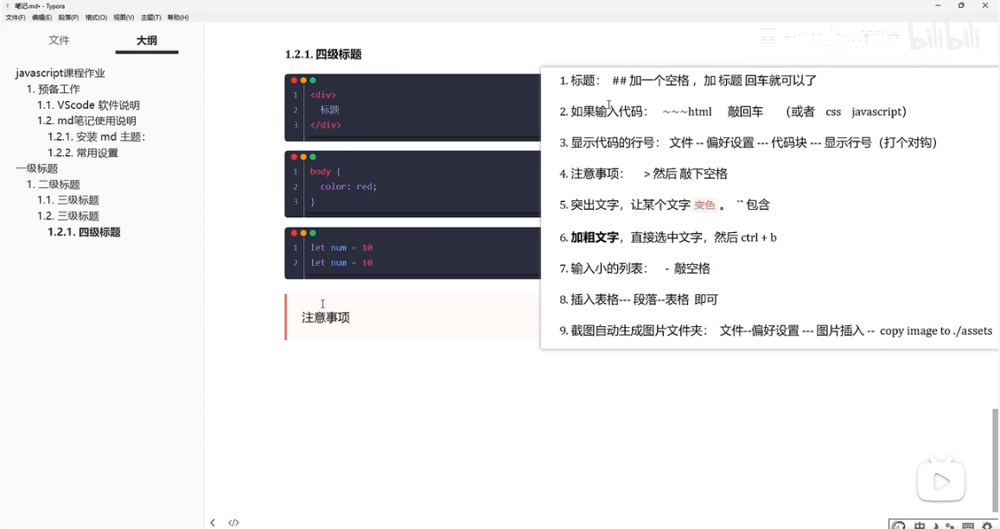

# 一级标题   Markdown笔记基本使用方法

## 二级标题

**`**整体写法类似于HTML**`**, 期望能够像写World那样发展！！！

### 三级标题


#### 四级标题


##### 五级标婷


###### 六级标题  哔哩哔哩网址

https://www.bilibili.com/video/BV1Xg4y1t7V5/?spm_id_from=333.999.0.0

######  六级标题  输入代码

```html
html
<div>
    标题
</div>
```

```css
css
body{
	color:red
}
```

```javascript
javascript
<script>
    let num = 10
</script>
```


###### 六级标签  显示代码的行号

显示代码的行号：文件--偏好设置--Markdown--显示行号（打个对勾）（`重启生效`）


###### 六级标题  注意事项   >然后敲下空格

>  注意事项 ： >然后敲下空格
>
>  > 我们
>  >
>  > > 我们注意了
>  > >
>  > > > 我们要特别注意了
>  > > >
>  > > > >我们要特别小心注意了
>  > > > >
>  > > > >> bingo ************************************************************************************

###### 六级标题  突出文字，让某个文字`变色`，``包含文字类容即可

单词`let`声明


###### 六级标题 加粗文字  直接选中文字，然后 Ctrl+b

这是 **加粗** 文字


###### 六级标题 输入小的列表  - 敲空格

- 注意事项
  - 第一点
    - 第一点
  - 第二点
    - 第一点

###### 六级标题 插入表格 --- 段落 --- 表格  即可

| 123  | 456  | 789  |
| :--: | :--: | :--: |
| 123  | 456  | 789  |
| 123  | 456  | 789  |
| 123  | 456  | 789  |


###### 六级标题   截图自动生成图片文件夹， 文件 -- 偏好设置 --- 图片插入 -- 允许使用相对路径 -- copy image to ./assets


###### 六级标题  链接写法  链接文字都是用[方括号]来标记

- [不知道写些什么](http://www.baidu.com)是什么意思


